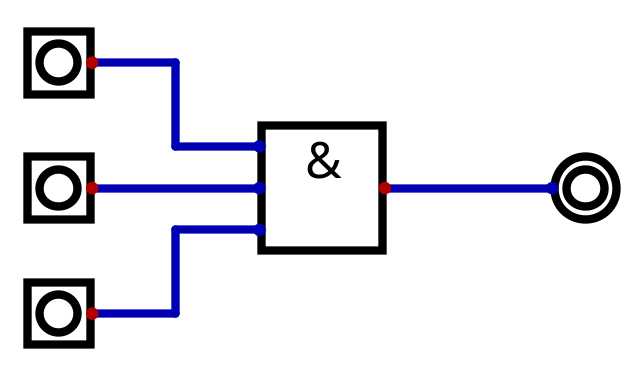
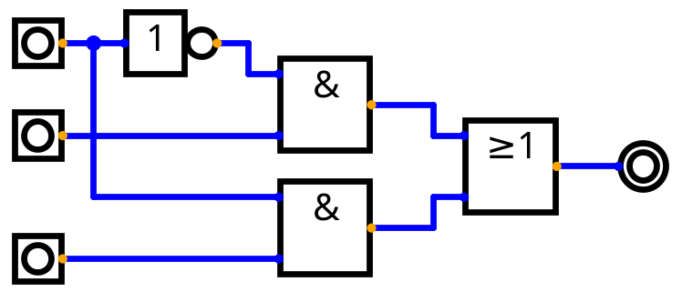
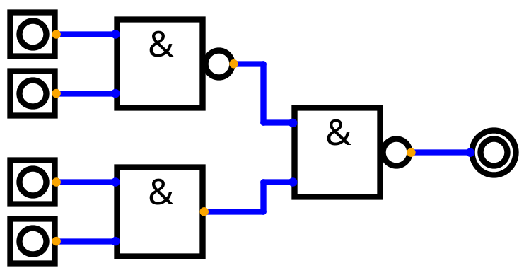
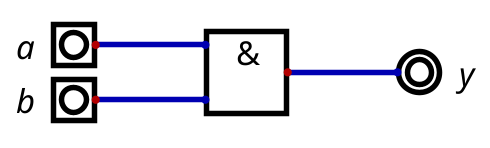
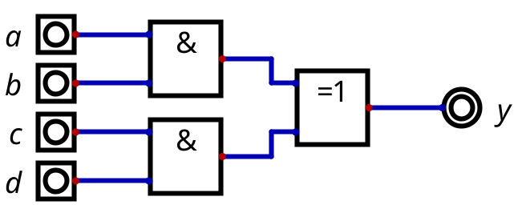

# Blandade uppgifter inför prov

<ol>

<li>

Rita grindnät för de booleska uttrycken.

1. $ y=abc $
1. $ y=a+b+c $
1. $ y=(a+b)(c+d) $
1. $ y=a^{\prime}b + ac $
1. $ y=a^{\prime}+b^{\prime} + c $
1. $ y=(a \oplus b) c^{\prime} $
1. $ y=((ab)^{\prime} (cd))^{\prime} $

Svar

1. 
1. 
1. 
2. 
3. 
4. 
5. 

</li>

<li>

Skriv sanningstabell för uttrycken i förra uppgiften.

Svar

<ol>
<li>

| $a$ | $b$ | $c$ | $y = abc$ |
| --- | --- | --- | --- |
| 0 | 0 | 0 | 0 |
| 0 | 0 | 1 | 0 |
| 0 | 1 | 0 | 0 |
| 0 | 1 | 1 | 0 |
| 1 | 0 | 0 | 0 |
| 1 | 0 | 1 | 0 |
| 1 | 1 | 0 | 0 |
| 1 | 1 | 1 | 1 |

</li>
<li>

| $a$ | $b$ | $c$ | $y = a + b + c$ |
| --- | --- | --- | --- |
| 0 | 0 | 0 | 0 |
| 0 | 0 | 1 | 1 |
| 0 | 1 | 0 | 1 |
| 0 | 1 | 1 | 1 |
| 1 | 0 | 0 | 1 |
| 1 | 0 | 1 | 1 |
| 1 | 1 | 0 | 1 |
| 1 | 1 | 1 | 1 |

</li>
<li>

| $a$ | $b$ | $c$ | $d$ | $y = (a + b)(c + d)$ |
| --- | --- | --- | --- | --- |
| 0 | 0 | 0 | 0 | 0 |
| 0 | 0 | 0 | 1 | 0 |
| 0 | 0 | 1 | 0 | 0 |
| 0 | 0 | 1 | 1 | 0 |
| 0 | 1 | 0 | 0 | 0 |
| 0 | 1 | 0 | 1 | 1 |
| 0 | 1 | 1 | 0 | 1 |
| 0 | 1 | 1 | 1 | 1 |
| 1 | 0 | 0 | 0 | 0 |
| 1 | 0 | 0 | 1 | 1 |
| 1 | 0 | 1 | 0 | 1 |
| 1 | 0 | 1 | 1 | 1 |
| 1 | 1 | 0 | 0 | 0 |
| 1 | 1 | 0 | 1 | 1 |
| 1 | 1 | 1 | 0 | 1 |
| 1 | 1 | 1 | 1 | 1 |

</li>
<li>

| $a$ | $b$ | $c$ | $y = a' b + ac$ |
| --- | --- | --- | --- |
| 0 | 0 | 0 | 0 |
| 0 | 0 | 1 | 0 |
| 0 | 1 | 0 | 1 |
| 0 | 1 | 1 | 1 |
| 1 | 0 | 0 | 0 |
| 1 | 0 | 1 | 1 |
| 1 | 1 | 0 | 0 |
| 1 | 1 | 1 | 1 |

</li>
<li>

| $a$ | $b$ | $c$ | $y = a' + b' + c$ |
| --- | --- | --- | --- |
| 0 | 0 | 0 | 1 |
| 0 | 0 | 1 | 1 |
| 0 | 1 | 0 | 1 |
| 0 | 1 | 1 | 1 |
| 1 | 0 | 0 | 1 |
| 1 | 0 | 1 | 1 |
| 1 | 1 | 0 | 0 |
| 1 | 1 | 1 | 1 |

</li>
<li>

| $a$ | $b$ | $c$ | $y = (a \oplus b) c'$ |
| --- | --- | --- | --- |
| 0 | 0 | 0 | 0 |
| 0 | 0 | 1 | 0 |
| 0 | 1 | 0 | 1 |
| 0 | 1 | 1 | 0 |
| 1 | 0 | 0 | 1 |
| 1 | 0 | 1 | 0 |
| 1 | 1 | 0 | 0 |
| 1 | 1 | 1 | 0 |

</li>
<li>

| $a$ | $b$ | $c$ | $d$ | $y = ((ab)' (cd))'$ |
| --- | --- | --- | --- | --- |
| 0 | 0 | 0 | 0 | 1 |
| 0 | 0 | 0 | 1 | 1 |
| 0 | 0 | 1 | 0 | 1 |
| 0 | 0 | 1 | 1 | 1 |
| 0 | 1 | 0 | 0 | 1 |
| 0 | 1 | 0 | 1 | 1 |
| 0 | 1 | 1 | 0 | 1 |
| 0 | 1 | 1 | 1 | 1 |
| 1 | 0 | 0 | 0 | 1 |
| 1 | 0 | 0 | 1 | 1 |
| 1 | 0 | 1 | 0 | 1 |
| 1 | 0 | 1 | 1 | 1 |
| 1 | 1 | 0 | 0 | 1 |
| 1 | 1 | 0 | 1 | 1 |
| 1 | 1 | 1 | 0 | 1 |
| 1 | 1 | 1 | 1 | 0 |

</li>
</ol>

</li>

<li>

Skriv booleska uttrycket för grindnäten.

1. 
2. 
3. 
4. 

Svar

1. $y=ab$
2. $y=a+(b+c)^{\prime}$
3. $y=ab \oplus cd$
4. $y=a^{\prime} b^{\prime} + c $

</li>

<li>

Konvertera det binära talet $ 1010 _ {2} $ till decimalt.

Svar

$$
1010 _ {2} = 1 \cdot 2^3 + 0 \cdot 2^2 + 1 \cdot 2^1 + 0 \cdot 2^0 \\\\

= 8 + 0 + 2 + 0  \\\\

= 10 _ {10}

$$

</li>

<li>

Konvertera det decimala talet $ 25 _ {10} $ till binärt.

Svar

$$
25 _ {10} = 16 + 8 + 1 \\\\

= 11001 _ {2}

$$

</li>

<li>

Konvertera det hexadecimala talet $ 15 _ {16} $ till decimalt.

Svar

$$
15 _ {16} = 1 \cdot 16^1 + 5 \cdot 16^0 \\\\
= 16 + 5  \\\\
= 21 _ {10}
$$

</li>

<li>

Konvertera det decimala talet $ 100 _ {10} $ till hexadecimalt.

Svar

$$
100 _ {10} = 6 \cdot 16^1 + 4 \cdot 16^0 \\\\
= 64 _ {16}
$$

</li>

<li>

Konvertera det binära talet $ 110011 _ {2} $ till hexadecimalt.

Svar

$$
110011 _ {2} = 3 \cdot 16^1 + 3 \cdot 16^0 \\\\
= 33 _ {16}
$$

</li>

<li>

Konvertera det hexadecimala talet $ 3C _ {16} $ till binärt.

Svar

$$
3C _ {16} = 0011 \cdot 1100 \\\\
= 111100 _ {2}
$$

</li>

<li>

Konvertera det decimala talet $ 47 _ {10} $ till binärt och hexadecimalt.

Svar

$$
47 _ {10} = 32 + 8 + 4 + 2 + 1 \\\\
= 101111 _ {2} \\\\
$$

$$
47 _ {10} = 2 \cdot 16^1 + 15 \cdot 16^0 \\\\
= 2F _ {16}
$$

</li>

</ol>

## Mer övning inför provet

- Titta på gamla prov, finns på [förstasidan för momentet digitalteknik](/digitalteknik#prov).

- Läs igenom alla kapitel