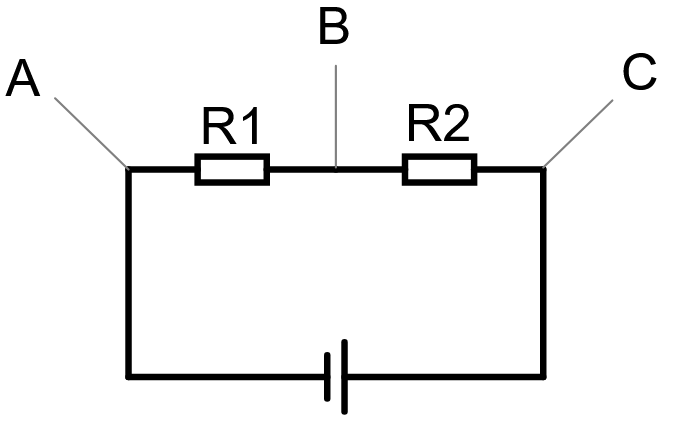
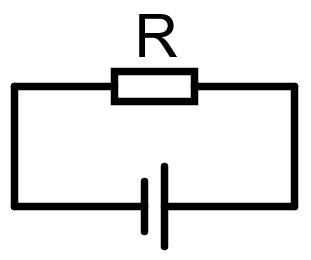

# Laborationsuppgifter

I följande uppgifter ska ni koppla upp kretsar och använda en Arduino för att mäta spänning mellan noder i kretsen. Med hjälp av mätningarna kommer ni besvara frågor om elektriska storheter.

Arduinons pin `5V` är pluspol och `GND` är minuspol. Man mäter spänning mellan `A0` och `A1`.

```admonish example title="Exempelkrets"

Här är ett exempel på hur man mäter spänningen över en resistor med Arduino Nano.

Resistorn ska kopplas in mellan `+` och `-`, sen mäter man med hjälp av `A0` och `A1`.


```

<ol class="exercises">

<li>

Koppla upp följande krets:



1. Vilken resistans har R1?

2. Vad är spänningen mellan...
    - `GND` och nod `A`?
    - nod `A` och nod `B`?
    - nod `B` och nod `C`?

3. Med hjälp av mätvärdena, beräkna strömmen i kretsen.

4. Hur stor den okända resistansen $R_2$ ?

</li>

<li>

Koppla upp följande krets:


1. Vad är spänningen mellan...
    - `A` och `B`
    - `B` och `C`
    - `A` och `D`
    - `C` och `D`
    - `A` och `C`
    - `B` och `D`

2. Varför är en del av spänningarna negativa i förra deluppgiften?

3. Hur stor är delströmmen...
    - $I_1$, i den övre grenen
    - $I_2$, i den nedre grenen

4. Vad är den totala strömmen $I$ i kretsen?

5. Om man vill byta ut dessa två resistorer mot **EN**, och behålla samma totala ström $I$, vilken resistans ska den ha?

</li>

<li>

Koppla upp följande krets (där $R$ ska variera, läs uppgiften).

Uppgiften är att hitta den maximala ström som Arduinon klarar av innan den överbelastas och stänger av sig själv.



<ol>

<li>


Börja med $R = 1\kilo\ohm$, och välj sedan lägre och lägre resistorer tills ni märker att lampan för `TX` slutar blinka, **då har arduino uppnått sin maximala belastning!**.

Räkna också ut kretsens ström vid varje resistor.

</li>

<li>

Vad är den maximala effekt som Arduinon klarar av?

</li>

<ol>

</li>

</ol>
