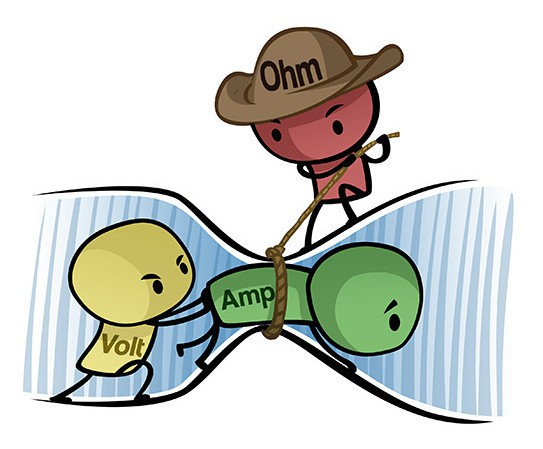
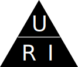

# Ohms lag
Nu har vi lärt oss om spänning, ström och resistans. Sista biten i pusslet är <u>ohms lag</u>. Den berättar för oss hur de olika elektriska storheterna beror på varandra.

Som figuren visar är det **spänning** som driver **strömmen** framåt, men **resistansen** som begränsar strömmen.

Denna balans beskrivs också av matematik:

$$I=\frac{U}{R}$$
$$U=RI$$
$$R=\frac{U}{I}$$

Alla tre formler är sanna, samtidigt! För att komma ihåg formlerna kan man använda *Ohms triangel*:

För att lösa ut en viss storhet täcker man över den med handen och läser vad det står. När man täcker över $U$ med handen, är det enda man kan se $RI$. Det betyder att $U=RI$.