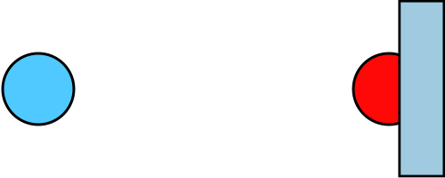
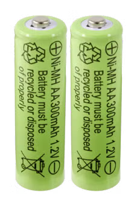

# Potential och spänning
Naturen består av partiklar. En del partiklar har något som kallas för laddning.
I kursen bryr vi oss inte så mycket om det, mer än att **elektronen** ger upphov till potentialskillnad (spänning) i material.

## Laddning
Det låter kanske bekant att universum består av atomer, som i sin tur består av protoner, neutroner och elektroner. Sedan tidigare vet vi också att det finns laddningar som är varandras motsatser. **Positiva** laddningar (+) och **negativa** laddningar (-).

Finns flera laddningar relativt nära varandra kan de ge upphov till två olika krafter. Ifall laddningarna är båda positiva eller båda negativa uppstår en repellerande kraft. Partiklarna kommer alltså stöta bort varandra. Ifall laddningarna är olika, ena är positiv och den andra negativ, uppstår en attraherande kraft. Partiklarna kommer i detta fall att dras mot varandra. 


## Potential

När det finns en kraft som verkar på ett förmål måste energi tillföras för att förflytta föremålet motsatt kraftens riktning. Exempelvis är graviationskraften en kraft som verkar *neråt*. Det krävs alltså energi att förflytta föremål *uppåt*. Detta är anledningen till varför det är jobbigt att gå uppför en backe eller varför hissar kräver el. 

```admonish info title="En inofficiell definition"
Potential är (typ) ett mått på hur mycket energi ett föremål har lagrat i sig på grund av den har förflyttats i motsatt en krafts riktning. När ett föremål rör sig i kraftens riktning minskar dess potential.  
```
```admonish info title="Enhet"
Potential mäts i enheten volt, $\volt$.
```

*Tyngdkraftspotentialen* är den potentialen som beskriver hur mycket energi som finns lagrat i ett föremål när den befinner sig på en viss höjd. Ju högre upp föremålet kommer desto mer energi finns sparat i den. När föremålet sedan rör sig neråt är den inte längre "lika långt ifrån" marken.


Elektrisk potential har att göra med de elektriska laddningarna. Vi har lärt oss att partiklars olika laddningar ger upphov till krafter som antingen attraherar eller repellerar partiklarna från varandra.

> Om vi tänker oss att vi har två partiklar som <u>attraherar</u> varandra och ena partikeln sitter fast i väggen mean den andra partikeln är fri i luften. Vi kan tänka oss att den fria partikeln är på ett avstånd som ger den potentialen 5 $\volt$. När den dras närmare väggen minskar dess potential och vid väggen kan vi säga att potentialen är 0 $\volt$.
> 
> 
> *Partiklarna "vill" mot varandra. När de hålls isär finns det potentiell energi.*

## Nod
Noder är något som kommer bli intressant för oss när vi jobbar med elektriska kretsar. Just nu introducerar vi begreppet så att ni ska börja få en uppfattning. 

Det som kännetecknar <u>olika</u> noder är att de har olika potentialer. Vi kan se de olika avstånden till väggen i exemplet ovan som olika noder.

```admonish info title="Definition"
En **nod** är en punkt eller ett föremål som är helt ihopkopplat med sig själv, och allt har samma potential (potentialskillnad noll).
```

Det betyder att två ändar av samma sladd är i den elektriska världen **samma nod**.

Definitionen ovan kan upplevas som förvirrande. Hittills har vi lärt oss att potentialen hos ett föremål beror på energin som finns sparat i föremålet i ett visst läge (där en kraft verkar).
Vad betyder att det är samma nod om det är sammankopplat med sig själv? 

Jo, tyvärr är den elektriska potentialen inte riktigt så enkel i elektriska kretsar. Potential är något som förbrukas, för att det ska ske i en krets behövs något som kallas för motstånd. Detta är dock något som vi ska lära oss lite senare så nu får ni nöja er med att i elektriska kretsar  slutar två punkter vara samma nod om det finns någon **resistans** mellan dem. 

```admonish tip
Senare i avsnittet lär vi oss att det är bra att tänka på noder som **platser där komponenter möts**.
```

## Spänning

Oftast är det inte potentialen som är intressant utan skillnaden i den. 

Du kan tänka dig att du måste gå uppför en trappa till byggnadens nästa våning. Trapporna mellan våning 1 och 2 samt våning 2 och 3 är likadana. Du kommer inte tycka att det är jobbigare att gå uppför trappan från våning 2 till 3 än det är att gå från våning 1 till 2 även om din tyngdkraftspotential är högre i de högre våningarna. 

På samma sätt fungerar det i den elektriska världen. Det är sällan det är viktigt vad den faktiska potentialen är utan det viktiga är skillnaden mellan två noder. Det är denna skillnad vi kallar för **spänning**.

```admonish info title="Storhet och enhet"
**Storheten** spänning betecknas med $U$ och har **enheten** volt, $\volt$.
```

```admonish example title="Exempel på spänning"
Vanliga AA-batterier har spänningen $1.5 \volt$. Vad betyder det?

Jo, det betyder att från minus- till pluspol är det en potentialskillnad på $1.5 \volt$.



```

### Spänningskällor
En spänningskälla är någonting som skapar en spänning, alltså en imbalans av potential. Ett exempel är batterier, som skapar spänning genom kemiska processer. Andra exempel på spänningskällor är vägguttag. Spänningen i vägguttag är däremot växelspänning, vilket vi inte kommer att räkna på i kursen.

### Voltmeter
Utrustning som kan mäta spänning kallas för <u>voltmeter</u>.


*En multimeter kan mäta spänning, ström och resistans.*