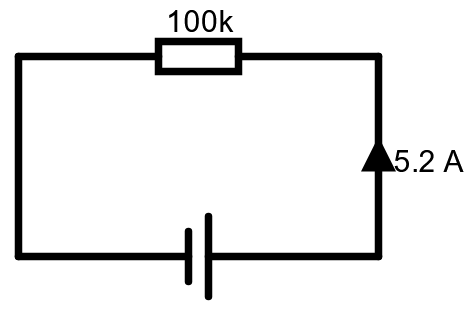
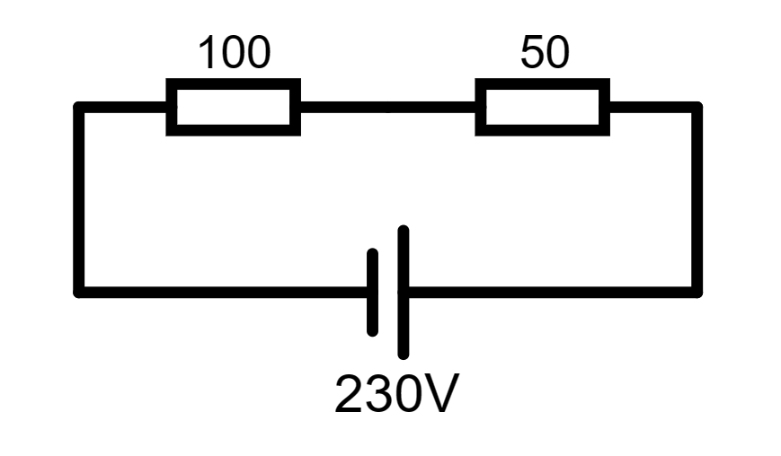
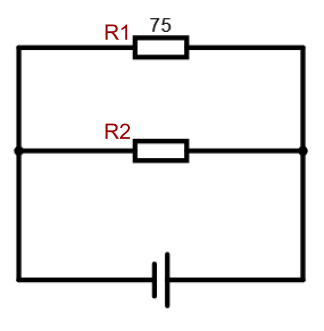

# Uppgifter v46

## Effekt

<ol>

<li>

Beräkna effekten i kretsen, testa gärna att använda olika formler!

Svar

**SVAR:** 

$529\watt$

---
**ALT 1:**

Eftersom $U$ och $R$ är givna är det passande med $P = \frac{U^2}{R}$

$P = \frac{(230 \volt)^2}{100 \ohm} = \frac{52900\volt}{100\ohm} = 529 \watt$

 

**ALT 1:**

Det går också bra att först räkna ut strömmen $I$ och sen beräkna effekten genom $P=UI$.

$I=\frac{U}{R} = \frac{230\volt}{100\ohm} = 2.3\ampere$

$P = UI = 230\volt \cdot 2.3\ampere = 529\watt$

</li>

<li>

Beräkna effekten i kretsen.

Svar

**SVAR:** 

$2.704 \mega\watt$

---

**ALT 1:**

$$P = I^2 R = (5.2 \ampere)^2 \cdot 100 \kilo\ohm = 2.704 \mega\watt$$

 

**ALT 2:**

Räkna först ut vad spänningen borde vara, sen använd $P = U I$.

$$U = R I = 100 \kilo\ohm \cdot 5.2 \ampere = 520 \kilo\volt$$

$$P = U I = 520 \kilo\volt \cdot 5.2 \ampere = 2.704 \mega\watt$$

</li>

<li>

Beräkna effekten i kretsen. Beräkna också strömmen med hjälp av effekten. 

Svar

**SVAR:** 

$P=1.44\watt$, $I=120\milli\ampere$

---

$P=\frac{U^2}{R}=\frac{(12\volt)^2}{100\ohm}=1.44\watt$

$I=\sqrt{\frac{P}{R}}=\sqrt{\frac{1.44\watt}{100\ohm}}=120\milli\ampere$

</li>
<li>

Beräkna effekten i kretsen.

Svar

**SVAR:** 

$ P \approx 352.67\watt$

---

$P = \frac{U^2}{R} = \frac{(230\volt)^2}{150\ohm} = 352.67\watt$

</li>
<li>

a) Hur stor är spänningen över varje resistor?

b) Hur stor effekt skapas i varje resistor?

c) Vad är den totala effekten i kretsen?

Svar

**SVAR:** 

$U_1 \approx 153.33 \volt$, $U_2 \approx 76.67 \volt$

$P_1 \approx 235.11 \watt$, $P_2 \approx 117.56 \watt$

$P \approx 352.67 \watt$

---

**ALT 1:**

Man kan börja med att räkna ut strömmen. $I=\frac{U}{R}$. 

$$I = \frac{230\volt}{(100 + 50)\ohm} \approx 1.53\ampere$$
 
a) 
$$U_1 = I \cdot 100\ohm \approx 153.33\volt$$

$$U_2 = I \cdot 50\ohm \approx 76.67\volt$$

b)
$$P_1 = U_1 \cdot I \approx 235.11\watt$$

$$P_2 = U_2 \cdot I \approx 117.56\watt$$

c) 

$$P = U \cdot I = 230\volt \cdot 1.53\ampere = 352.67\watt$$

 

**ALT 2:**

Man kan skippa att räkna ut strömmen och istället använda spänningsdelning för att lista ut spänningen över varje resistor.

$$R _ {tot} = 100\ohm + 50\ohm = 150\ohm$$

a) 
$$U_1 = U \cdot \frac{R_1}{R _ {tot}} = 230\volt \cdot \frac{100\ohm}{150\ohm} = 153.33\volt$$

$$U_2 = U \cdot \frac{R_2}{R _ {tot}} = 230\volt \cdot \frac{50\ohm}{150\ohm} = 76.67\volt$$

b) Vi räknar ut effekten direkt på varje resistor genom $P=\frac{U}{R}$
$$P_1 = \frac{U_1^2}{R_1} = \frac{(153.33\volt)^2}{100\ohm} = 235.11\watt$$

$$P_2 = \frac{U_2^2}{R_2} = \frac{(76.67\volt)^2}{50\ohm} = 117.56\watt$$

c)

$$P = U \cdot I = 230\volt \cdot 1.53\ampere = 352.67\watt$$

</li>
<li>

Beräkna strömmen och spänningen i kretsen om du vet att totala effekten $P=1\kilo\watt$.

Svar

**SVAR:** 

$U=100\volt$, $I=10\ampere$

---

Vi kan omformulera effektformeln.

$$P=\frac{U^2}{R} \iff PR = U^2 \iff \sqrt{PR} = U$$

alltså är $U = \sqrt{PR}$.

$$U = \sqrt{1\kilo\watt \cdot 10\ohm} = \sqrt{10000} = 100\volt$$

Vi kan nu räkna ut strömmen genom Ohms lag.

$$I = \frac{U}{R} = \frac{100\volt}{10\ohm} = 10\ampere$$

</li>
<li>

Vad är ersättningsresistansen $R _ {ers}$ för parallellkopplingen om...

a) $R_1 = 75\ohm$, $R_2 = 100\ohm$

b) $R_1 = 100\ohm$, $R_2 = 100\ohm$

c) $R_1 = 3\ohm$, $R_2 = 5\ohm$

Svar

**SVAR:** 

a) $R _ {ers} = 300/7 \ohm \approx 42.86\ohm$

b) $R _ {ers} = 50\ohm$

c) $R _ {ers} = 15/8 \ohm = 1.875 \ohm$

---

Formeln för att räkna ut ersättningsresistans är:
$$ \frac{1}{R _ {ers}} = \frac{1}{R_1} + \frac{1}{R_2} + ... $$

a) 
$$ \frac{1}{R _ {ers}} = \frac{1}{75} + \frac{1}{100} = \frac{4}{300} + \frac{3}{300} = \frac{7}{300} $$
$$ R _ {ers} = \frac{300}{7} \ohm \approx 42.86\ohm $$

b) 
$$ \frac{1}{R _ {ers}} = \frac{1}{100} + \frac{1}{100} = \frac{2}{100} = \frac{1}{50} $$
$$ R _ {ers} = 50\ohm $$

c)
$$ \frac{1}{R _ {ers}} = \frac{1}{3} + \frac{1}{5} = \frac{5}{15} + \frac{3}{15} = \frac{8}{15} $$
$$ R _ {ers} = \frac{15}{8} \ohm = 1.875 \ohm $$

</li>
<li>

Du vet att ersättningsresistansen $R _ {ers} = 15.78\ohm$ för de parallellkopplade resistorerna.

Vad borde $R_2$ ha för värde om $R_1 = 75\ohm$

Svar

**SVAR:** 

---

</li>
<li>

Beräkna effekten i kretsen.

Svar

**SVAR:** 

---

</li>
<li>

Beräkna effekten i kretsen.

Svar

**SVAR:** 

---

</li>
<li>

Beräkna effekten i kretsen.

Svar

**SVAR:** 

---

</li>
<li>

Beräkna effekten i kretsen.

Svar

**SVAR:** 

---

</li>
<li>

Beräkna effekten i kretsen.

Svar

**SVAR:** 

---

</li>
<li>

Beräkna effekten i kretsen.

Svar

**SVAR:** 

---

</li>

</ol>