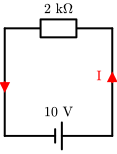

# Uppgifter

<ol>

<li>

Hur stor är **strömmen** i kretsen?

Svar

**SVAR:** $I = 5\milli\ampere$

---

$U = 10\volt$, $R=2\kilo\ohm$.

$$ I = U/R $$
$$ I = \frac{10\volt}{2\kilo\ohm} = 5\milli\ampere $$

</li>

<li>

Hur stor resistans i kretsen?

Svar

**SVAR:** $R = 500\ohm$

---

$U = 3.3\volt$, $I=6.6\milli\ohm$.

$$ R = U/I $$
$$ R = \frac{3.3\volt}{6.6\milli\ampere} = 500\ohm $$

</li>

<li>

Hur stor spänning behövs i kretsen?

Svar

**SVAR:** $U = 23\volt$

---

$R = 1\kilo\ohm$, $I=23\milli\ohm$.

$$ U = R I $$
$$ U = 1\kilo\ohm \cdot 23\milli\ampere = 23\volt $$

</li>

<li>

a) Hur stor är den **totala spänningen**?

b) Hur stor är **strömmen** i kretsen?

Svar

**SVAR:**

a) $U = 6\volt$

b) $I = 6\milli\ampere$

---

$U_1 = 3\volt$, $U_2 = 3\volt$, $R = 1\kilo\ohm$.

a) $U = U_1 + U_2 = 3\volt + 3\volt = 6\volt$

b) $I = \frac{U}{R} = \frac{6\volt}{1\kilo\ohm} = 6\milli\ampere$

</li>

<li>

a) Hur stor är del**spänningen** över varje resistor?

b) Hur stor är **strömmen** i kretsen?

Svar

**SVAR:** 
a) $U_1 = 4\volt$, $U_2 = 8\volt$

b) $I = 2\milli\ampere$

---

Man kan lösa detta på två sätt: antingen genom att först räkna ut totala strömmen och applicera Ohms lag, eller så kan man ta hjälp av **KVL**.

**Ohms lag:**

$U = 12\volt$, $R_1=2\kilo\ohm$, $R_2=4\kilo\ohm$.

$R _ {tot} = R_1 + R_2 = 6\kilo\ohm$

$$ I = \frac{U}{ R _ {tot} } = \frac{12\volt}{6\kilo\ohm} = 2\milli\ampere $$

$$ U_1 = I R_1 = 2\milli\ampere \cdot 2\kilo\ohm = 4\volt $$

$$ U_2 = I R_2 = 2\milli\ampere \cdot 4\kilo\ohm = 8\volt $$

**KVL:**

$R _ {tot} = R_1 + R_2 = 6\kilo\ohm$

$$ U_1 = U * \frac{R_1}{R _ {tot}} = 12\volt \cdot \frac{2\kilo\ohm}{6\kilo\ohm} = 4\volt $$

$$ U_2 = U - U_1 = 12\volt - 4\volt = 8\volt $$

</li>

<li>

Vad behöver den högra kretsen ha för **resistans** för att få samma ström som den vänstra?

Svar

**SVAR:** $R _ {ers} \approx 33.3\ohm$

---

Frågan är egentligen, vad är ersättningresistansen för den vänstra kretsen? Eftersom strömmen också är given skulle man kunna lösa problemet utan att beräkna ersättningsresistansen, dock. Här är två sätt att lösa det:

**Ersättningsresistans:**

$R_1=100\ohm$, $R_2=50\ohm$.

$$ R _ {ers} = \frac{1}{\frac{1}{R_1} + \frac{1}{R_2}} = \frac{1}{\frac{1}{100\ohm} + \frac{1}{50\ohm}} \approx 33.3\ohm $$

**Ohms lag:**

$U = 5\volt$, $I = 150\milli\ampere$.

$$ R _ {ers} = \frac{U}{I} = \frac{5\volt}{150\milli\ampere} \approx 33.3\ohm $$

</li>

<li>

Svar

**SVAR:** 

---

</li>
<li>

Svar

**SVAR:** 

---

</li>
<li>

Svar

**SVAR:** 

---

</li>
<li>

Svar

**SVAR:** 

---

</li>
<li>

Svar

**SVAR:** 

---

</li>
<li>

Svar

**SVAR:** 

---

</li>
<li>

Svar

**SVAR:** 

---

</li>
<li>

Svar

**SVAR:** 

---

</li>
<li>

Svar

**SVAR:** 

---

</li>
<li>

Svar

**SVAR:** 

---

</li>
</ol>