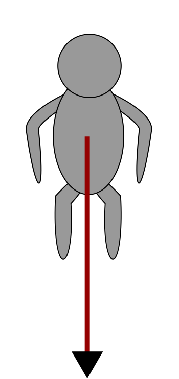
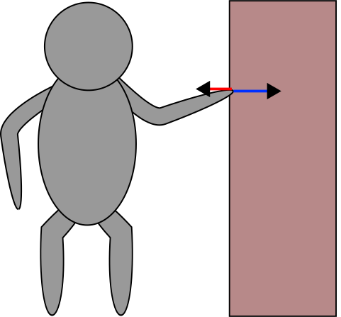
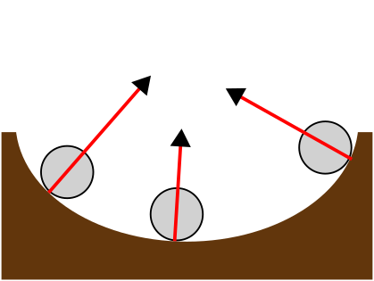

# Krafter

Krafter är en stor del i mekanikens värld, och även vår egen. I avsnittet kommer vi lära oss hur krafter påverkar vår omvärld, vilka de vanligaste krafterna är och även vilka lagar Isaac Newton har observerat kring krafter. 

Vi börjar med att förstå vad en kraft är. 

```admonish info title="Definition"

Krafter är det som ändrar ett föremåls rörelse eller form.

```

När du puttar undan soffan påverkar du den med en kraft. Först hade den ingen hastighet, sen hade den det. Denna förändring förklarar vi med krafter. 

```admonish info title="Storhet och enhet"

Krafter har enheten newton, $\newton$ och betecknas med $F$. 

Man särskiljer på olika krafter med olika index, exempelvis $F_g$ för tyngdkraften

```

## Rita krafter
Krafter ritas som pilar. Pilarnas längd visar hur stor kraften är och riktningen berättar också i vilken riktning kraften verkar. Det är också viktigt att rita krafterna från rätt punkt. Exempelvis

När något har en storlek och riktning kallas det för en [vektor](../vektorer/index.md). Hur dessa beräknas kommer vi gå igenom i nästa delkapitel. 

```admonish question title="Vad betyder det att krafter har en riktning?"

Ni kan tänka er att ni håller i en penna. Pennan kan ni röra både uppåt och nedåt, framåt och bakåt, eller i vilken riktning som helst. Det kan vara viktigt att hålla reda på vilken riktning krafter verkar speciellt när det finns flera som verkar på samma föremål. 

```

## Vanliga krafter
Eftersom det rörelse är en så stor del av vår vardag är även krafter det. Nedan beskrivs de krafter som ni ska förstå dess påverkan på förmål och kunna rita in i figurer. 

```admonish danger title="Krafter är INTE hastighet"

Krafter som ni nu har förstått har att göra med hastighet, men det är viktigt att ni förstår att en kraft inte **är** en hastighet. Krafter enbart **förändrar** hastigheten.

```


### Tyngdkraft
Gravitationskraft eller tyngdkraft är den kraft som verkar på alla objekt mot jordens mittpunkt, vi kommer framöver bara säga att den verkar *nedåt*. 

Tyngdkraften betecknas $\bm {F_g}$ och utan den hade vi flutit iväg i rymden vid minsta lilla steg. Tyngdkraften ritas alltid från ett föremåls *tyngdpunkt* (oftast i mitten av föremålet)



### Normalkraft
Normalkraften är en kontaktkraft som uppstår som en motkraft till en annan kraft som verkar på föremålet. Man kan se det som att det är normalkraften som gör ont när du slår näven i väggen. Det är också på grund av normalkraften som din hand inte kommer längre fram än väggen. Utan en kraft att sakta in din hand hade den åkt rätt igenom. 

```admonish question title="Hur ser det ut med krafterna när man tar sönder väggen?"

När din hand rör väggen trycker du på den med en kraft. Normalkraften uppstår och trycker din hand ifrån väggen. De olika krafterna tar ut varandra och din hand rör sig inte åt någon riktning.

Ifall vi istället skulle ha en betongvägg som ännu inte har torkat så kan du antagligen trycka din hand en bit in i väggen. Kraftmässigt ser detta ut som att den kraft du trycker med på väggen är större än normalkraften.  



```

Normalkraften betecknas $\bm {F_N}$ och verkar alltid vinkelrätt mot ytan som påverkas av en kraft. Pilen ritas från kontaktytan.



### Friktionskraft
Friktionskraft är en kontaktkraft som uppstår när två ytor gnids mot varandra. Friktionskraften är den som gör det tungt att putta föremål längs med marken. 

Olika underlag har olika så kallad friktionskonstant och det är därför olika lätt att putta föremål på dem. Exempelvis är det lättare att flytta något tungt på ett slätt golv än på en lurvig matta. 

Det är också friktionskraften som gör att vi kan komma någon vart. Utan den hade vi varit fast på samma ställe (lite som att springa på is). 

Friktionskraften betecknas $\bm {F_f}$ och ritas från kontaktytan.


### Bromskrafter
Bromskrafter är sådana krafter som bromsar in ett förmål och därmed minskar dess hastighet. Ifall du kör en bil och slutar gasa kommer bilen att saktas in. Detta sker på grund av de bromsande krafterna. 

Bromsande krafter uppstår bland annat  på grund av luftmotstånd, vattenmotstånd mm. 

Friktionskraften är också en bromsande kraft men vi behöver skilja på dem ibland och introducerar därför de som separata krafter. Den bromsande kraften betecknas $\bm {F _ {broms}}$ och verkar i hastighetens motsatta riktning.

Det kommer att vara tydligt i uppgifter ifall friktionskraften redan finns inräknad i bromskraften eller inte.


## Friläggning
När vi vill ta reda på vad som händer med ett föremål måste vi först hitta och rita ut alla krafter som verkar på den. Friläggningen gäller alltid bara **ett** föremål.


När alla krafter läggs ihop ser vi ifall krafter har tagit ut varandra eller förstärkt varandra. Den kraften som sedan faktiskt verkar är den **resulterande kraften** och betecknas $\bm F_R$.

## Jämvikt

När den resulterande kraften är noll råder *jämvikt* och vi säger att föremålet är i **vila**. Vila kan både betyda att föremålet inte har någon hastighet alls, eller att hastigheten är konstant.

```admonish question title="Varför är $F_R = 0$ vid konstant hastighet?"

Vi vet att krafter förändrar hastigheten. Ifall hastigheten är konstant sker ingen förändring och den verkande kraften, $F_R$ bör därför vara noll. 

```

