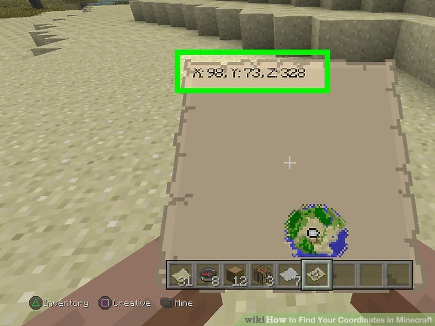
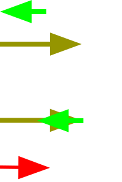

# Vektorer

Krafter mäts som vektorer. Vektorer är i princip tal som är två (-eller tre)-dimensionella.

Vektorer har både **storlek** och **riktning**.


```admonish example title="Koordinater är vektorer"

Koordinater är ett exempel på vektorer i vardagen. Det räcker inte med 1 siffra för att beskriva var du är.

Vanligtvis är koordinater tvådimensionella: longitud, latitud.



I datorspel kanske du vill veta din höjd också. Då blir koordinaten tredimensionell.

```

```admonish example title="Krafter är vektorer"

Om en raket skjuts iväg snett kommer den uppleva kraft som lyfter den uppåt och åt sidan. Denna kraft kan beskrivas som en vektor.


```

## Resultant

Resultanten är den kraft som är summan av alla krafter som verkar på ett föremål. Det räcker med resultanten för att räkna ut hur föremålet kommer att påverkas.

Resultanten brukar betecknas $F_R$.

## Likriktade krafter

Resultantens storlek när krafter pekar åt samma håll är summan av krafternas storlek.


$$F_R = F_1 + F_2$$

## Motriktade krafter

Resultantens storlek när krafter pekar åt olika håll är differensen krafternas storlek.



$$F_R = F_1 - F_2$$

```admonish warning title='Negativt eller positivt?'

Man måste välja vad som är "positiv riktning".

Standard är att kalla höger för positivt, vänster för negativt. Uppåt brukar vara positivt, nedåt negativt.

```

## Vinkelräta krafter

Om två krafter är vinkelräta mot varandra måste man använda pythagoras sats för att räkna ut den resulterande kraften.


$$F_R = \sqrt{F_1^2 + F_2^2}$$

(Detta kommer vi använda oss av mycket när vi räknar ut resultanten av komposanter.)

## Komposanter

Man kan antingen beskriva en resultant med dess storlek och riktning, eller med dess komposanter.

Komposanter är hur mycket kraften verkar i de olika leden (x, y).

Komposanter är **alltid** vinkelräta mot varandra, och därför kan man räkna ut deras resultant med hjälp av pythagoras sats:

### Beräkning av komposanter

En resultant med storlek $R$ och vinkel $\theta$ kommer dess komposanter vara:

$$ F_x = F_R \cdot \cos{\theta} $$
$$ F_y = F_R \cdot \sin{\theta} $$

```admonish example title="Beräkning av komposanter"

Om en kraft på 10 N verkar i en vinkel på 30 grader, hur mycket verkar den i x-led och y-led?

$$ F_x = 10 \cdot \cos{30} = 8.66 N $$
$$ F_y = 10 \cdot \sin{30} = 5 N $$

```

### Beräkning av vinkel

Om man bara vet komposanterna $F_x$ och $F_y$, så vet vi hur man räknar ut storleken på resultanten, men hur räknar man ut dess vinkel?

Då använder man funktionen $\arctan$.

$$ \theta = \arctan{(\frac{F_y}{F_x})} $$

```admonish example title="Beräkning av resultant från komposanter"

Vi vet att en kraft på 8 N verkar i x-led och 6 N i y-led. Hur stor är resultantens storlek och vinkel?

$$ F_R = \sqrt{8^2 + 6^2} = 10 N $$

$$ \theta = \arctan{(\frac{6}{8})} = 36.87 \degree $$

```
