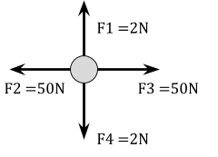
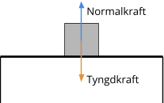

# Uppgifter | Vektorer

<ol>

<li>

Hur **stor** är krafternas **resultanten** på bollen?

a) 

b) 

c) 

d) 

e) 

f) 

g) 

Svar

**SVAR:** 

a) 7 N

b) 2 N

c) $\sqrt 2 \newton$

d) 0 N

e) 5 N

f) $\sqrt 5 \newton$

g) 0 N

</li>

<li>

Vilka av bollarna från förra uppgiften är **i jämvikt?**

Svar

**SVAR:** 

**d** och **g**, eftersom deras resultant är 0.

</li>

<li>

[Frilägg](?search=frilägg), det vill säga rita ut alla krafter som pilar:

a) Lådan

a) Bordet

Svar

a) 

b) 

</li>

<li>

Beräkna krafterna från förra uppgiften om

a) Lådan väger 2 kg.

b) Bordet väger 8 kg.

Svar

a) $$\text{Normalkraft} = \text{Tyngdkraft} = mg = 2 \cdot 9.82 = 19.64 \newton$$

b)

$$\text{Tyngdkraft(låda)} = 19.64 \newton$$

$$\text{Tyngdkraft(bord)} = 8 \cdot 9.82 = 78.56 \newton$$

$$\text{Normalkraft(bord)} = \text{Tyngdkraft(låda)} + \text{Tyngdkraft(bord)}$$
$$\text{Normalkraft(bord)} = 19.64 + 78.56 = 98.2 \newton $$

Vi antar att allt är jämnt utplacerat på bordet. Då tar varje ben upp hälften av normalkraften: $$\frac{\text{Normalkraft(bord)}}{2} = 49.1 \newton$$

</li>

<li>

Svar

</li>

<li>

Svar

</li>

<li>

Svar

</li>

<li>

Svar

</li>

<li>

Svar

</li>

<li>

Svar

</li>

<li>

Svar

</li>

<li>

Svar

</li>

<li>

Svar

</li>

</ol>
