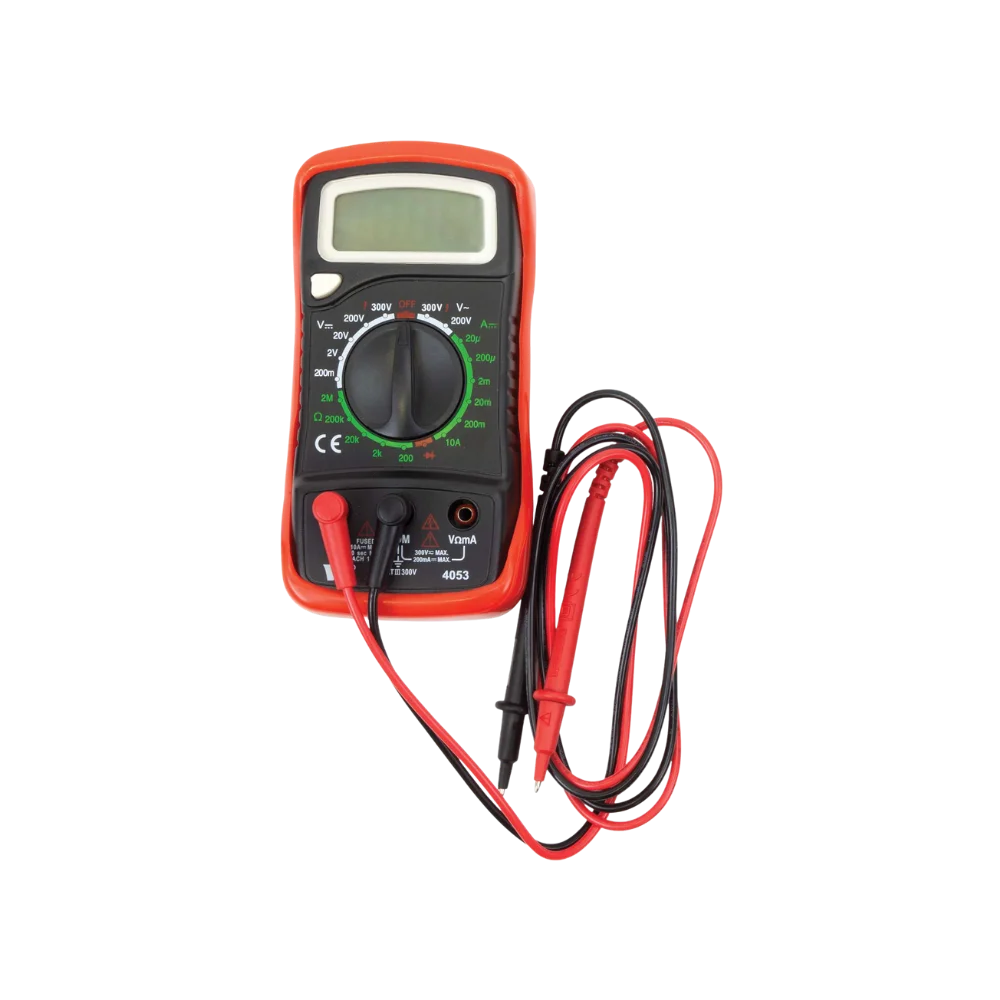
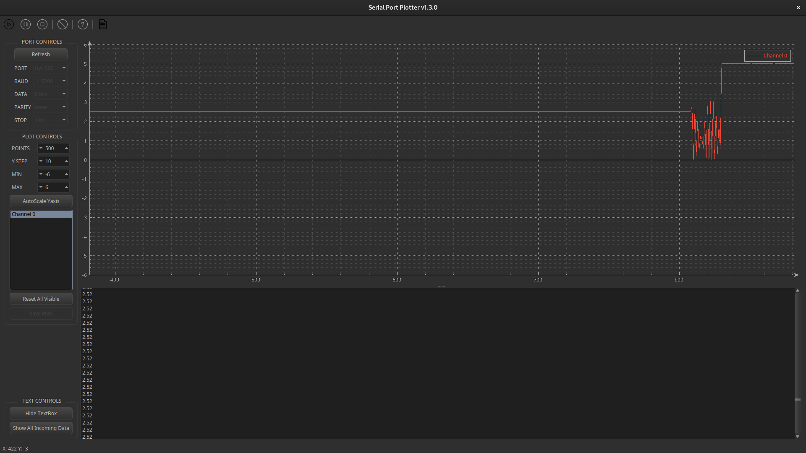

# Teori

Här kommer lite förkunskaper och praktisk information om utrustningen som används. Läs igenom detta innan ni påbörjar uppgifterna.

## Breadboard
En breadboard ska användas för att koppla ihop komponenterna.

Hålen på breadboarden är ihopkopplade enligt bilden nedan.


En **Arduino Nano** får plats perfekt över en breadboard. Den ska placeras enligt bilden nedan.


```admonish example title="Exempelkrets"

Här är ett exempel på hur man seriekopplar två resistorer på en breadboard, och sedan mäter delspänningen över ena resistorn.


_Kretsen som ska kopplas upp_


_Hur det ser ut på en breadboard_

```

## Voltmeter

Arduinon är programmerad att agera som en voltmeter.

Man mäter spänning mellan `A0` och `A1`.

`A0` är som den röda sladden på en multimeter, medan `A1` är som den svarta:



Så här gör man för att mäta spänning:
1. Koppla `A0` till den punkt med högre potential.
2. Koppla `A1` till den punkt med lägre potential.
3. Koppla Arduinon till datorn.
4. Starta seriell plotter, läs av värdet som printas.

```admonish info title="Negativ spänning?"
Om mätvärden är negativa, betyder det att ni har råkat koppla omvänt, alltså `A0` är kopplad till lägre potential och `A1` till högre potential.
```

## Seriell kommunikation

Arduinon är programmerad att beräkna spänningen från `A0` till `A1`, och sen `print`:a informationen till den anslutna datorn.

För att se mätvärden behövs ett program som kan läsa **seriell data**. Ett bra program är [serial_port_plotter](https://github.com/CieNTi/serial_port_plotter/releases/download/v1.3.0/serial_port_plotter_Win_1.3.0.zip)


