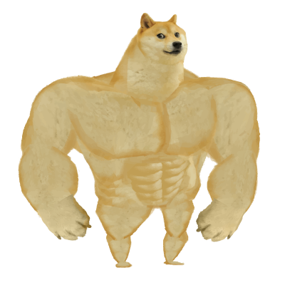
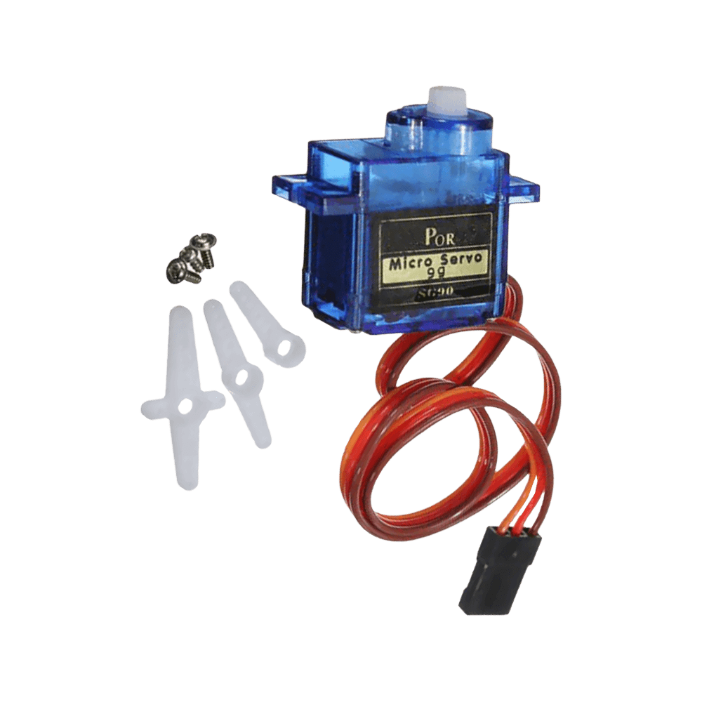
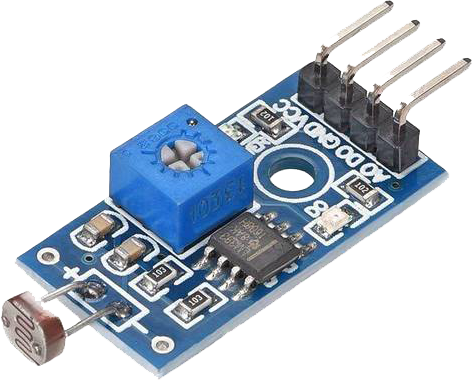

# Komponenter

Hur bygger man någonting "intelligent"? Detta kapitel kommer att ge en översikt över de komponenter som används inom mekatronik och hur de tillsammans kan skapa någonting som kan kallas för "intelligent".

Det finns en mängd olika komponenter som används inom mekatronik. Det kan kännas överväldigande att det finns så många olika, men sanningen är att det bara finns tre (3) huvudsakliga komponenter!

## Aktuator
När man ska få någonting att röra på sig, då behöver man en _aktuator_. Här kommer några exempel på aktuatorer.

> ### Muskel
> 
> Vi människor har muskler som är aktuatorer. De kan dra ihop sig och därmed skapa rörelse. Våra muskler drivs av elektriska signaler från hjärnan (som är en [styrenhet](#styrenhet)).

> ### DC-motor
> 
> En DC-motor är en elektrisk motor som drivs av likström
(DC, direct current, är engelska för likström).
>
> Den är bra lämpad för att skapa rotation när det viktiga är att det snurrar, men kanske inte lika viktigt hur exakt det snurrar.
>
> En användning för DC-motorer är att driva hjulen på en radiostyrd bil.

> ### Servomotor
> 
> En servo är till skillnad från en [DC-motor](#dc-motor) inte gjord att snurra flera varv, utan att ställa in sig på en viss vinkel. Vanligtvis kan en servo ställa in sig på en vinkel mellan 0&deg; och 180&deg;.
>
> En användning för en servomotor är att skapa styrning till en radiostyrd bil.

## Sensor

När man ska ta in information från omvärlden, då behöver man en _sensor_. Här kommer några vanliga exempel på sensorer.

> ### Ögon
> 
>
> Vi människor har många sensorer, som vi kallar för sinnen. Ett av våra sinnen är synen, och själva organet som tar emot ljus och omvandlar det till signaler som hjärnan kan tolka är ögat. Ögat är en biologisk sensor som till exempel kan mäta färg, distans och ljusstyrka.

> ### Fotoresistor
> 
>
> En fotoresistor är en elektronisk komponent som ändrar sin resistans beroende på hur mycket ljus som träffar den. Man kan använda en fotoresistor fölist r att mäta ljusstyrkan i ett rum, eller bygga ett inbrottslarm som bygger på att en laserstråle konstant lyser på fotoresistorn.

> ### Distansmätare
> 
>
> En distansmätare är en sensor som mäter avståndet till ett objekt. Det finns många olika lösningar för att mäta avstånd. En vanlig lösning är att använda ultraljud, där ljudet skickas ut från sensorn och sedan mäts tiden det tar för ljudet att komma tillbaka.

## Styrenhet

Med [sensorer](#sensor) kan vi alltså samla in infomation från omvärlden, och med [aktuatorer](#aktuator) kan vi skapa rörelse eller påverka omvärlden- nu kommer sista biten av pusslet: _styrenheten_.

Styrenheten är det som tar beslut baserat på informationen från sensorerna och sedan styr aktuatorerna.

> ### Hjärnan
> 
>
> Vi människor har en biologisk styrenhet som kallas för hjärnan (eller är det _vi som är hjärnan?_). Hjärnan tar emot information från sinnen och skickar sedan signaler till vår kropp för att vi ska kunna agera på informationen.

> ### Mikrokontrollrar
> 
> 
> En mikrokontroller är en liten dator som kan programmeras för att styra olika komponenter. Den kan användas för att styra en robot, en drönare eller en kaffebryggare.
> 
> En av de mest populära mikrokontrollerna är **Arduino**, och vi kommer också använda Arduino senare i kursen

## Sammanfattning

Det finns tre huvudsakliga komponenter inom mekatronik: [aktuatorer](#aktuator), [sensorer](#sensor) och [styrenheter](#styrenhet). När alla dessa tre komponenter samarbetar kan vi skapa någonting som börjar likna något "intelligent".