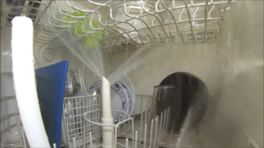

# Mekatronik i vardagen

När stöter vi på mekatronik till vardags? Ja, hela tiden typ. Tänk på en bil.

- Bilar har motorer som drivs av att bränsle exploderar och får kolvar (mekanik) att röra på sig, och i moderna bilar styrs hela processen av en dator (elektronik).

Eller en diskmaskin?

- Diskmaskiner har elektriska motorer (elektronik) som driver pumpar och roterande armar (mekanik), och en dator (elektronik) som styr hela programmet.

När man väl börjar tänka på det är det svårt att komma på prylar som inte innehåller både mekanik och elektronik!

## Frågor
- Finns det verkligen prylar som endast innehåller elektronik? Kanske en spelkonsol?
  - Det är sant att datorer som spelkonsoler består av en hel del elektroniska komponenter (som processorer, minnen, kondensatorer), men någon har designat konsolens knappar och tillhörande kontrollers knappar och joystickar, och det skulle jag säga är mekanik!
