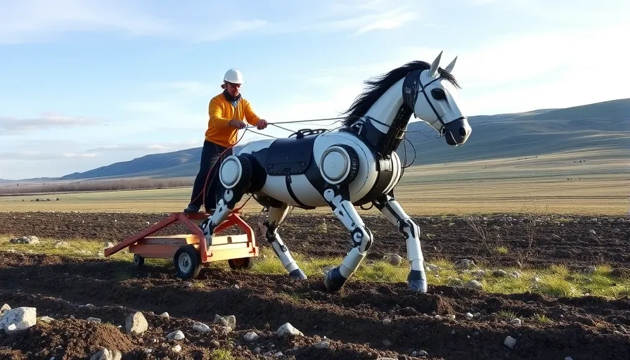
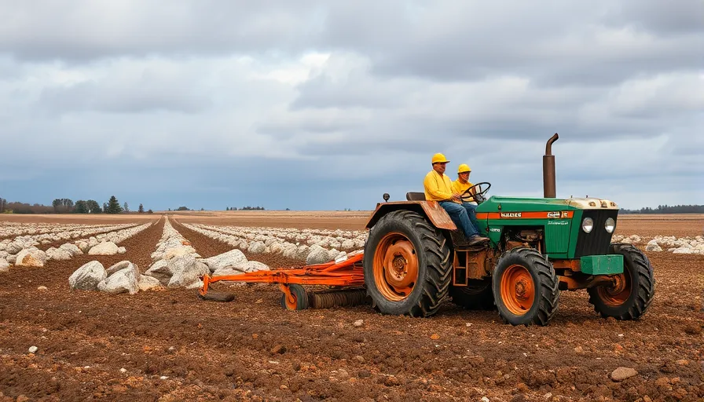

# Vad är mekatronik?

Vad är mekatronik? Varför ska vi bry oss om det?

Förr i tiden när man skulle ploga en åker, hur gjorde man då?

Man anlitade helt enkelt ett par gubbar och hästar och satte igång, arbetet skulle inte bli enklare.

Men idag har hästen blivit totalt ersatt av något annat!

*En robothäst[^robot_horse]! Typ..*

Vad var det som hände? Jo, vi gick från rent **mekaniska** lösningar (handarbete, fysisk ansträngning) till komplicerade maskiner med elektroniska komponenter.

> Mekanik + Elektronik = Mekatronik <3

I denna kurs kommer vi lära oss att räkna på krafter, skapa elektriska kretsar som har 'logik', helt enkelt förutsäga framtiden! Det är det som är poängen med att studera verkligheten, att kunna förutse vad som kommer hända och förbereda sig för det.

**Mekatronik** beskriver sånt som består av både [mekaniska](/begrepp#mekanik) delar och [elektroniska](/begrepp#elektronik) delar.

>### Mekanik
>Ett väldigt generellt ord som innefattar:
>- Fysiken bakom krafter och rörelser
>- Tekniska lösningar / uppfinningar som endast består av delar som gör det enklare att utnyttja krafter. Exempel på enkla mekaniska lösningar är [hävstången](/mekanik) eller [det lutande planet](/mekanik)

## Frågor
- Kan du komma på exempel på prylar som består av **både mekaniska och elektroniska delar?**
- Kan du komma på exempel på prylar som **endast består av mekaniska delar?**
- Kan du komma på exempel på prylar som **endast består av elektroniska delar?**

 

[^robot_horse]: <https://www.wikiwand.com/en/Horsey_Horseless>
