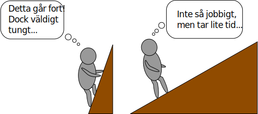

# Mekanikens gyllene regel

Varför väljer vi att växla ned till 1:an på cykeln när det blir tung backe?

Varför bygger vi trappor istället för stegar i hus?

Svar på dessa frågor har med <u>mekanikens gyllene regel</u> att göra.

## Vad säger regeln?

Mekanikens gyllene regel är en tumregel som säger att man kan göra ett arbete under ett kort avstånd med mycket kraft, eller samma arbete under långt avstånd med lite kraft.

Regeln säger i princip: "arbete är en avvägning mellan hur jobbigt man vill ha det, jämfört med hur länge man vill dra ut på det."

[Vridmoment](../vridmoment/index.md) är ett till bra exempel då regeln visar sig. Ju längre momentarm man använder, desto större vridmoment kan man skapa, även om man använder lika lite kraft.
