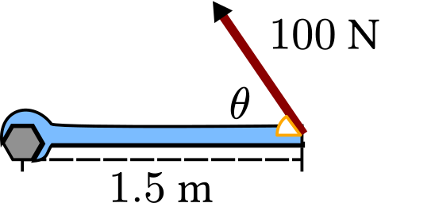

# Uppgifter mekanik

<ol>

## Krafter och vektorer

<li>

Hur **stor** är krafternas **resultant** på bollen? Räkna också ut vilken resultantens vinkel.

a) 

b) 

c) 

d) 

e) 

f) 

g) 

Svar

**SVAR:**

a) 7 N, $0 \degree$

b) 2 N, $-90 \degree$

c) $\sqrt 2 \newton$, $45 \degree$

d) 0 N (saknar vinkel)

e) 5 N, $\arctan{(\frac{-3}{4})} = -36.9 \degree$

f) $\sqrt 5 \newton$, $\arctan{(\frac{1-2}{2})} = -26.6 \degree $

g) $0 \newton$ (saknar vinkel)

</li>

<li>

Vilka av bollarna från förra uppgiften är **i jämvikt?**

Svar

**SVAR:**

**d** och **g**, eftersom deras resultant är 0.

</li>

<li>

[Frilägg](?search=frilägg), det vill säga rita ut alla krafter som pilar:

a) Lådan

a) Bordet

Svar

a) 

b) 

</li>

<li>

Beräkna krafterna från förra uppgiften om

a) Lådan väger 2 kg.

b) Bordet väger 8 kg.

Svar

a) $$\text{Normalkraft} = \text{Tyngdkraft} = mg = 2 \cdot 9.82 = 19.64 \newton$$

b)

$$\text{Tyngdkraft(låda)} = 19.64 \newton$$

$$\text{Tyngdkraft(bord)} = 8 \cdot 9.82 = 78.56 \newton$$

$$\text{Normalkraft(bord)} = \text{Tyngdkraft(låda)} + \text{Tyngdkraft(bord)}$$
$$\text{Normalkraft(bord)} = 19.64 + 78.56 = 98.2 \newton $$

Vi antar att allt är jämnt utplacerat på bordet. Då tar varje ben upp hälften av normalkraften: $$\frac{\text{Normalkraft(bord)}}{2} = 49.1 \newton$$

</li>

## Kraftjämviktsproblem

<li>

En cyklist som väger 80 kg färdar i konstant hastighet. Färdaren trampar och skapar $1 \kilo\newton$ i kraft framåt. Cykeln väger ingenting.

a) Hur stora är de bromsande krafterna?

b) Hur stor är normalkrafterna som verkar på varje däck? (vi antar att tyngpunkten är perfekt i mitten.)

Svar

**SVAR:**

a) $1 \kilo\newton$

b) $392.8 \newton$

---

a) Vi vet att cyklisten skapar $1 \kilo\newton$ framåt. Då måste bromskrafterna vara lika stora för att cyklisten ska färdas i konstant hastighet (jämvikt).

b) Vi vet att tyngdkraften är $80 \cdot 9.82 = 785.6 \newton$. Då måste normalkraften vara lika stor som tyngdkraften för att cyklisten ska färdas i konstant hastighet. Då blir normalkraften $392.8 \newton$ på varje däck.

$ F_g = F_N = 785.6 \newton $, varje däck tar $ F_N / 2 = 392.8 \newton $.

</li>

<li>

Pelle har köpt ett bord som maximalt tål $900 \newton$. Kommer bordet gå sönder om vi lägger på 10 stycken $10\kilogram$ vikter på det?

Svar

**SVAR:**
Ja.

---

Vi vet att tyngdkraften för en vikt är $10 \cdot 9.82 = 98.2 \newton$. Då blir totala tyngdkraften $10 \cdot 98.2 = 982 \newton$.

Eftersom $ 982 > 900 $ kommer bordet gå sönder.

</li>

<li>

En båt har en lyftkraft på $4 \kilo\newton$ och en massa på $500 \kilogram$. Är båten i jämvikt?

Svar

**SVAR:**
Nej.

---

Tyngdkraften är $ 500 \cdot 9.82 = 4910 \newton $.

Summan av krafterna är $ 4000 - 4910 = -910 \newton $. (positivt uppåt)

Det blir alltså kraft nedåt över, alltså kommer båten sjunka! Den är inte i jämvikt!

</li>

<li>

En balk med tyngd $2000 \newton$ är hänger stilla med två rep enligt bilden. Hur stor är kraften i varje rep?

Svar

**SVAR:**

Ungefär $ 1 155 \newton $

---

Vi vet att tyngdkraften är $ 2000 \newton $.

Vi vet att summan av krafterna i x-led är 0, och summan av krafterna i y-led är 0.

$$ \uparrow : F _ {Ry} + F _ {Ry} = F \cdot g $$
$$ 2F \cdot {Ry} = 2000 \newton $$
$$ F \_ {Ry} = 1000 \newton $$

Vi vet att vinkeln är $ 60 \degree $, så vi kan använda trigonometri för att räkna ut kraften i repen.

$$ F _ {Ry} = F _ {R} \sin (60 \degree) $$
$$ 1000 = F _ {R} \sin (60 \degree) $$
$$ \frac {1000}{\sin (60 \degree)} = F _ {R} $$
$$ \frac {1000}{\sin (60 \degree)} = F \_ {R} \approx 1155 \newton $$

</li>

<li>
<a href="jämviktsproblem.pdf" target="_blank">Fler jämviktsproblem</a>
</li>

## Vridmoment

<li>

Hur stort vridmoment skapas om vinkeln:

a) $\theta = 90 \degree$

b) $\theta = 45 \degree$

c) $\theta = 30 \degree$

Svar

a) $ 150 \newton\meter $

b) $ 106.1 \newton\meter $

c) $ 75 \newton\meter $

---

$$ M = F _ \perp \cdot l $$

I detta fall får vi den vinkelräta kraften genom sinus:

$$ F _ \perp = 100 \newton \cdot \sin \theta $$

a) $ M = 100 \sin{(90 \degree)} \cdot 1.5 = 100 \cdot 1.5 = \bm{150 \newton\meter}$

a) $ M = 100 \sin{(45 \degree)} \cdot 1.5 \approx 70.7 \cdot 1.5 \approx \bm{106.1 \newton\meter}$

a) $ M = 100 \sin{(30 \degree)} \cdot 1.5 = 50 \cdot 1.5 = \bm{75 \newton\meter}$

</li>

<li>
<a href="vridmoment.pdf" target="_blank">Fler uppgifter om vridmoment</a> 
<a href="vridmoment_facit.pdf" target="_blank">Lösningar</a>
</li>

## Mekanikens gyllene regel
<li>
<a href="mekaniska_lösningar.pdf" target="_blank">Uppgifter om mekanikens gyllene regel</a> 
<a href="mekaniska_lösningar_facit.pdf" target="_blank">Lösningar</a>
</li>

</ol>
