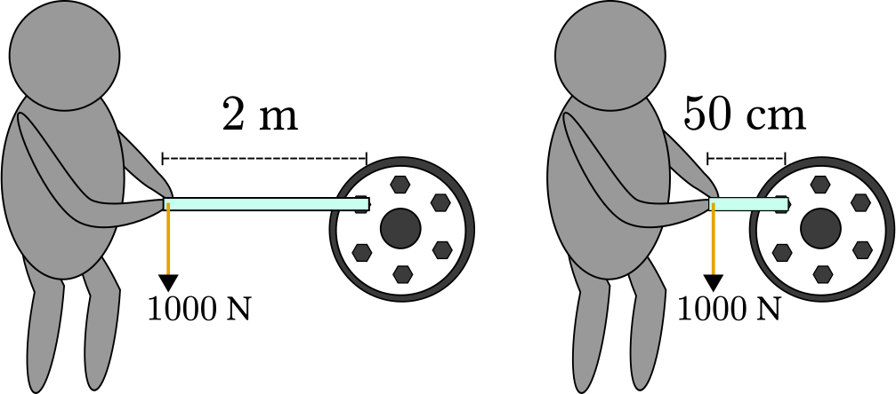
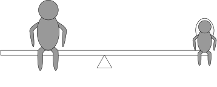

# Vridmoment

När man byter däck är det viktigt att dra åt bultarna. Det är till och med viktigt att dra åt _lagom_ mycket. Om det sitter för löst kanske däcket lossnar, men om man drar för hårt riskerar bulten och fälgen att skadas.

Hur ska däcktillverkarna kunna förklara hur mycket som är **lagom** att dra åt?

De skulle kunna beskriva det med en kraft, låt säga $ 1000 \newton $.

Det finns ett stort problem med det. Vi tänker oss att en mekaniker använder en $2\meter$ lång nyckel, medan en annan använder en som är $50 \centi\meter$.

Visst känns det rent intuitivt som att den med längre nyckel kommer dra åt bulten hårdare, även med samma kraft som den korta?

Det stämmer! En kraft som roterar runt en punkt kommer göra större arbete ju längre momentarm som används.

## Vad är vridmoment?

Så fort man har en **kraft** som verkar **runt en punkt** skapas <u>vridmoment</u>.

Man räknar ut det genom att multiplicera kraftens storlek med avståndet till rotationspunkten.

$$ M = F _ \perp \cdot l $$

Vad betyder $ F _ \perp $ ?

## Vad är en momentarm?

## Jämvikt i vridmoment

Två personer som väger olika mycket kan gunga på en gungbräda och till och med få den i balans. Hur är det möjligt?

