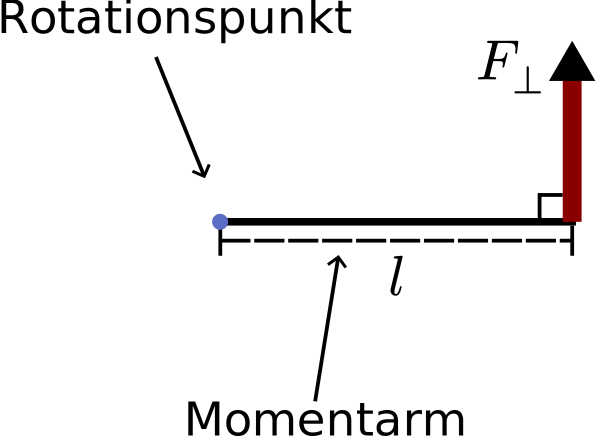
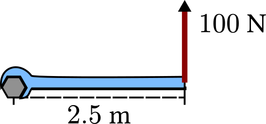
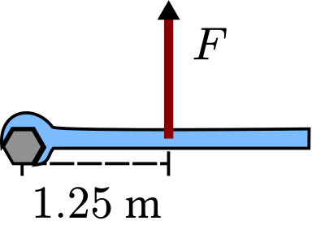
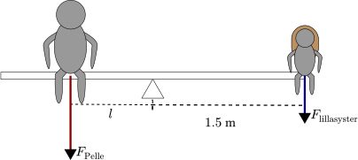

# Vridmoment

När man byter däck är det viktigt att dra åt bultarna. Det är till och med viktigt att dra åt _lagom_ mycket. Om det sitter för löst kanske däcket lossnar, men om man drar för hårt riskerar bulten och fälgen att skadas.


Hur ska däcktillverkarna kunna förklara hur mycket som är **lagom** att dra åt?

De skulle kunna beskriva det med en kraft, låt säga $ 1000 \newton $.

Det finns ett stort problem med det. Vi tänker oss att en mekaniker använder en $2\meter$ lång nyckel, medan en annan använder en som är $50 \centi\meter$.


Visst känns det rent intuitivt som att den med längre nyckel kommer dra åt bulten hårdare, även med samma kraft som den korta?

Det stämmer! En kraft som roterar runt en punkt kommer göra större nytta ju längre <u>momentarm</u> som används. Ett bättre sätt att specificera hur hårt bultarna ska dras åt är med <u>vridmoment</u>.

## Vad är vridmoment?

Så fort man har en **kraft** som verkar **runt en punkt** skapas <u>vridmoment</u>.



- **Rotationspunkten** är det som krafter verkar kring. Kan även kallas för vridpunkt, momentcentrum. Det kan vara bekvämt att ge den ett namn, som $\bm O$, för att sen kunna prata om olika punkters vridmoment.
- **Momentarmen** är det som faktiskt kopplar samman kraften med rotationspunkten. Det kan vara en skiftnyckel, en gungbräda eller din arm.
  - Längden på momentarmen betecknas oftast $ \bm l$ .
- Endast **den del av kraften som är vinkelrät mot momentarmen** (betecknas $\bm F _ \perp$) spelar roll när man räknar ut vridmoment.
- **Vridmoment** betecknas med $\bm M$ .
  - Vinklar som är moturs räknas som positiva. På samma sätt är moturs vridmoment positiv.

## Hur räknar man på vridmoment?

Vridmoment är produkten av den vinkelräta kraftens storlek och momentarmens längd.

$$ M = F \cdot l $$

```admonish example title="Vridmoment på bult"

Du drar vinkelrätt längst ut på en nyckel med $100 \newton$. Nyckeln är $2.5 \meter$ lång. Hur stort vridmoment skapas?



**Svar:** $M = F \cdot l = 100 \cdot 2.5 = 250 \newton \meter$

```

```admonish example title="Fortsättning, vridmoment på bult"

Om du vill ha samma vridmoment som i förra exemplet, $250\newton\meter$, men hålla i mitten på nyckeln istället, hur stor kraft behöver du tillföra?



**Svar:** $M = F \cdot l = 100 \newton \cdot 2.5 \meter = 250 \newton \cdot \meter$

```

## Jämvikt med vridmoment

Två personer som väger olika mycket kan få en gungbräda i balans. Hur är det möjligt?

Det har att göra med jämvikt. Mer specifikt jämvikt med vridmoment.


**Jämvikt i vridmoment** kallas det för när summan av all vridmoment är noll. Ett annat sätt att se på det är att det är lika mycket mot- som medurs vridmoment kring rotationscentrum.

$$\sum M = 0$$
eller
$$M _ {\text{moturs}} - M _ {\text{medurs}} = 0$$
$$M _ {\text{moturs}} = M _ {\text{medurs}}$$

```admonish example title="Gungbräda i jämvikt"

Hur långt bort från centrum, $l$, ska Pelle sitta om han och lillasystern ska få gungbrädan i jämvikt?



Pelle väger $80 \kilogram$ och lillasystern $50 \kilogram$. Gungbrädan är totalt $3\meter$ och lillasystern sitter precis på högra kanten.

Vi kan räkna mot- och medurs vridmoment för sig, och sen kombinera ekvationerna.

Systern bidrar med medurs vridmoment:

$$F _ \text{lillasyster} = 50 \cdot 9.82 = 491 \newton$$
$$ M _ {\text{medurs}} = F _ \text{lillasyster} \cdot 1.5 \meter = 491 \cdot 1.5 = 736.5 \newton \cdot \meter$$

Pelle bidrar med moturs vridmoment:

$$F _ \text{Pelle} = 80 \cdot 9.82 = 785.6 \newton$$
$$ M _ {\text{moturs}} = F _ \text{Pelle} \cdot l = 785.6 \cdot l$$

För att uppnå vridmomentsjämvikt ska $\sum M = 0$:

$$785.6 \cdot l - 736.5 = 0$$

$$ 785.6 \cdot l = 736.5$$

$$l = \frac{736.5}{785.6} = 0.9375 \meter$$

**Svar:** Han måste sitta ungefär en meter från centrum.

```
