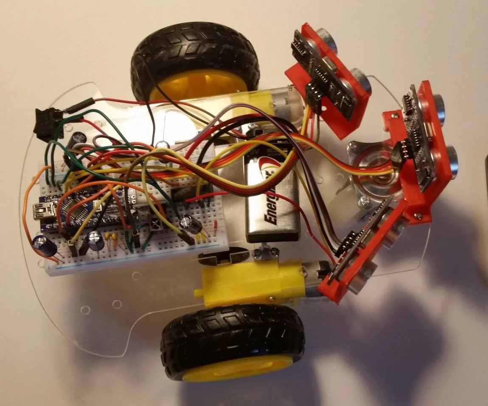
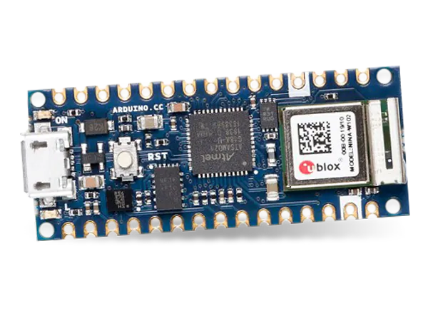

# Vad är en mikokontroller?

En mikrokontroller är en programmerbar liten dator som kan styra elektronik.

En mikrokontroller kan användas för att styra en mängd olika saker, till exempel en robot, en lampa eller en kaffebryggare.

_En självkörande bil skapad med mikrokontroller_ 

## Arduino

Arduino är som ett skal runt en mikrokontroller (vanligtvis AVR-processorer). Den har en stor community som delar med sig av sina projekt och kod, så ni kommer kunna använda det som inspiration för ert projekt. Det finns många olika modeller av Arduino, men vi kommer använda oss av en Arduino Nano.

Man skriver kod för Arduino i ett programmeringsspråk som bygger på C++. Man kan både skriva- och ladda upp koden till Arduino-enheten från en dator i programmet _Arduino IDE_.
